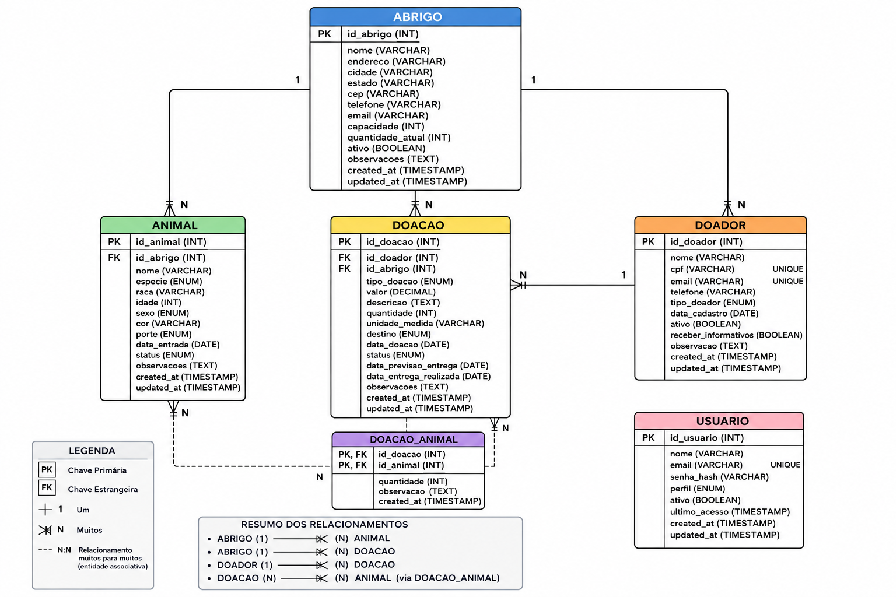
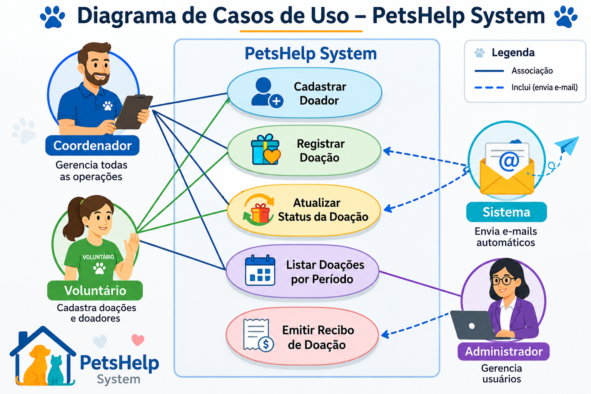

# Diagrama de Casos de Uso - PetsHelp System

## Diagrama Entidade-Relacionamento (MER)

*Figura 1: Diagrama Entidade-Relacionamento do sistema PetsHelp com 5 entidades principais.*

---

## Descrição Geral

O diagrama de casos de uso representa as interações entre os atores (Coordenador e Voluntários) e as funcionalidades do sistema PetsHelp. O sistema possui dois perfis de usuário com níveis de permissão distintos.

## Atores

| Ator | Descrição |
|------|-----------|
| **Coordenador** | Responsável máximo pela ONG. Possui acesso total a todas as funcionalidades do sistema, incluindo cadastros, relatórios e gestão de voluntários. |
| **Voluntário** | Membro da equipe operacional (10 voluntários). Pode registrar doações e distribuições, consultar estoque e buscar informações, mas não pode cadastrar ou excluir dados mestres. |
| **Sistema** | Ator não humano responsável por validações automáticas (CPF único, autenticação, logs). |

## Casos de Uso por Módulo

### Módulo de Autenticação

| ID | Caso de Uso | Atores | Descrição |
|----|-------------|--------|-----------|
| UC01 | Autenticar usuário | Coordenador, Voluntário | Realizar login com e-mail e senha. Sistema valida credenciais e redireciona conforme perfil. |

### Módulo de Cadastros (Coordenador)

| ID | Caso de Uso | Atores | Descrição |
|----|-------------|--------|-----------|
| UC02 | Cadastrar doador | Coordenador | Inserir dados do doador: nome, CPF, e-mail, telefone, endereço. |
| UC03 | Editar doador | Coordenador | Atualizar informações de um doador existente. |
| UC04 | Remover doador | Coordenador | Excluir (ou inativar) um doador do sistema. |
| UC05 | Cadastrar beneficiário | Coordenador | Inserir dados do animal: nome, espécie, idade, condição de saúde, responsável. |
| UC06 | Editar beneficiário | Coordenador | Atualizar informações de um animal cadastrado. |
| UC07 | Remover beneficiário | Coordenador | Excluir (ou inativar) um beneficiário do sistema. |
| UC08 | Cadastrar item | Coordenador | Inserir novo item (ração, medicamento, higiene) com nome, categoria e unidade. |
| UC09 | Editar item | Coordenador | Atualizar informações de um item existente. |
| UC10 | Gerenciar voluntários | Coordenador | Cadastrar, editar ou remover voluntários, definindo permissões de acesso. |

### Módulo de Registros (Coordenador e Voluntário)

| ID | Caso de Uso | Atores | Descrição |
|----|-------------|--------|-----------|
| UC11 | Registrar doação | Coordenador, Voluntário | Registrar entrada de doação: data, item, quantidade, doador, descrição. |
| UC12 | Registrar distribuição | Coordenador, Voluntário | Registrar saída de item para beneficiário: data, item, quantidade, beneficiário, observações. |
| UC13 | Consultar estoque | Coordenador, Voluntário | Visualizar quantidade disponível de cada item com alerta de estoque baixo. |

### Módulo de Consultas e Relatórios (Coordenador)

| ID | Caso de Uso | Atores | Descrição |
|----|-------------|--------|-----------|
| UC14 | Buscar doador | Coordenador, Voluntário | Pesquisar doador por nome ou CPF com autocomplete. |
| UC15 | Filtrar doações | Coordenador | Filtrar doações por período, item ou doador. |
| UC16 | Gerar relatório mensal | Coordenador | Gerar relatório consolidado de entradas vs saídas por categoria. |
| UC17 | Exportar dados | Coordenador | Exportar relatórios em formato CSV ou PDF. |
| UC18 | Visualizar dashboard | Coordenador | Visualizar indicadores: total de doações, itens mais doados, beneficiários atendidos. |
| UC19 | Relatório por voluntário | Coordenador | Visualizar produtividade de cada voluntário (quantas ações registrou). |

### Módulo de Auditoria (Coordenador)

| ID | Caso de Uso | Atores | Descrição |
|----|-------------|--------|-----------|
| UC20 | Gerar comprovante | Coordenador | Emitir comprovante de doação para enviar ao doador. |
| UC21 | Visualizar logs | Coordenador | Consultar histórico de operações realizadas no sistema (auditoria). |

### Validações Automáticas (Sistema)

| ID | Caso de Uso | Atores | Descrição |
|----|-------------|--------|-----------|
| UC22 | Validar CPF único | Sistema | Impedir cadastro de doador com CPF já existente no sistema. |
| UC23 | Validar e-mail único | Sistema | Impedir cadastro de doador ou usuário com e-mail duplicado. |
| UC24 | Registrar log automático | Sistema | Registrar todas as ações dos usuários para auditoria. |
| UC25 | Backup automático | Sistema | Realizar backup diário do banco de dados. |
| UC26 | Expirar sessão | Sistema | Encerrar sessão após 15 minutos de inatividade. |

## Diagrama Visual

---

## Matriz de Acesso por Perfil

| Caso de Uso | Coordenador | Voluntário | Sistema |
|-------------|-------------|------------|---------|
| UC01 - Autenticar usuário | ✅ | ✅ | ❌ |
| UC02 - Cadastrar doador | ✅ | ❌ | ❌ |
| UC03 - Editar doador | ✅ | ❌ | ❌ |
| UC04 - Remover doador | ✅ | ❌ | ❌ |
| UC05 - Cadastrar beneficiário | ✅ | ❌ | ❌ |
| UC06 - Editar beneficiário | ✅ | ❌ | ❌ |
| UC07 - Remover beneficiário | ✅ | ❌ | ❌ |
| UC08 - Cadastrar item | ✅ | ❌ | ❌ |
| UC09 - Editar item | ✅ | ❌ | ❌ |
| UC10 - Gerenciar voluntários | ✅ | ❌ | ❌ |
| UC11 - Registrar doação | ✅ | ✅ | ❌ |
| UC12 - Registrar distribuição | ✅ | ✅ | ❌ |
| UC13 - Consultar estoque | ✅ | ✅ | ❌ |
| UC14 - Buscar doador | ✅ | ✅ | ❌ |
| UC15 - Filtrar doações | ✅ | ❌ | ❌ |
| UC16 - Gerar relatório mensal | ✅ | ❌ | ❌ |
| UC17 - Exportar dados | ✅ | ❌ | ❌ |
| UC18 - Visualizar dashboard | ✅ | ❌ | ❌ |
| UC19 - Relatório por voluntário | ✅ | ❌ | ❌ |
| UC20 - Gerar comprovante | ✅ | ❌ | ❌ |
| UC21 - Visualizar logs | ✅ | ❌ | ❌ |
| UC22 - Validar CPF único | ❌ | ❌ | ✅ |
| UC23 - Validar e-mail único | ❌ | ❌ | ✅ |
| UC24 - Registrar log automático | ❌ | ❌ | ✅ |
| UC25 - Backup automático | ❌ | ❌ | ✅ |
| UC26 - Expirar sessão | ❌ | ❌ | ✅ |

---

**Última atualização:** 27/06/2026
**Versão:** 2.0